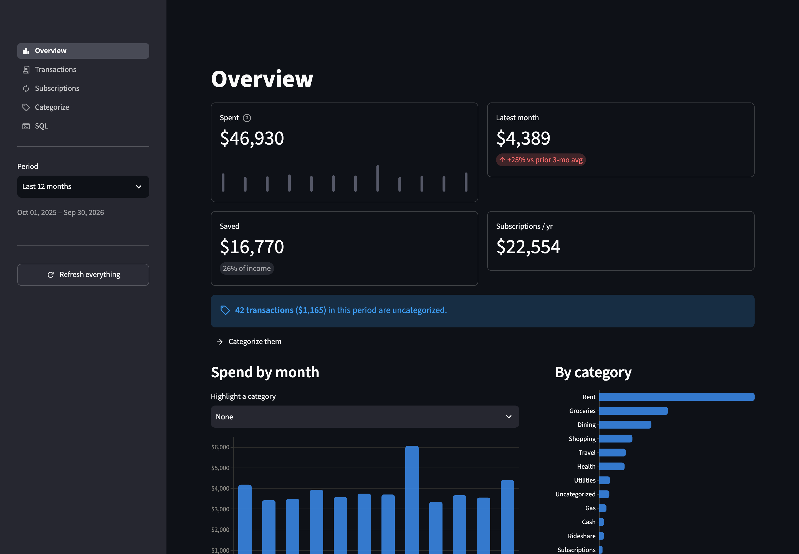
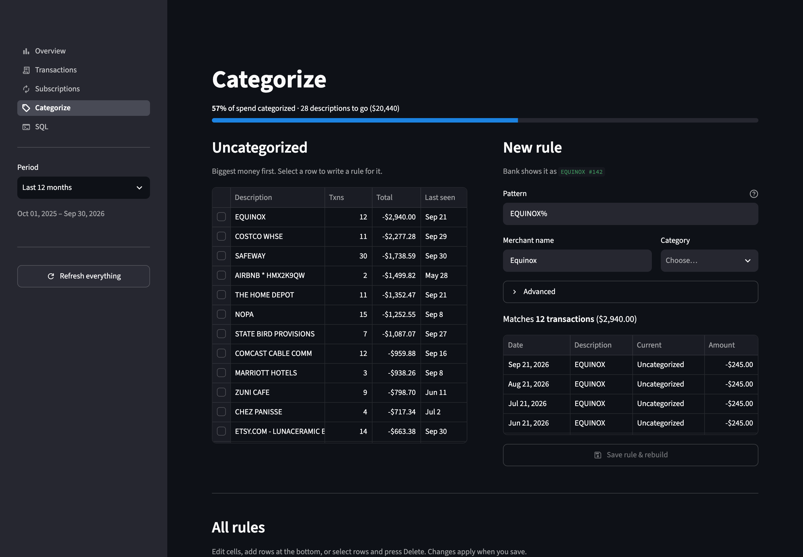
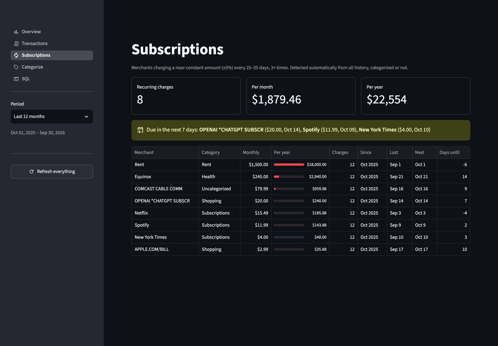

# finance-categorizer

**A local-first personal finance warehouse.** It turns the CSV exports
from my Chase and Amex accounts into clean, categorized, deduplicated
transactions, then shows them in a small app where I can explore
spending, catch subscriptions, and teach it new categories with a click.

Everything runs on my laptop. No bank logins, no aggregator, no cloud.



<sub>All screenshots use the synthetic data from `pixi run dummy-data`.</sub>

---

## Why I built it

Budgeting apps want your bank credentials and categorize transactions
however they like. I wanted something I could trust and correct:

- **My data stays on my machine.** Bank CSV exports go in, and a single
  DuckDB file comes out.
- **Categorization I can read.** Every category comes from a rule in a
  CSV file. I can see why a transaction landed where it did, and fixing
  it is a one-line change.
- **A real data stack in miniature.** It's a weekend-sized project that
  uses the same ingestion, transformation, and testing patterns you'd
  use on a production warehouse.

## What it does

| | |
|---|---|
| **Loads Chase and Amex exports** | Detects each export format from its header, so you drop files in a folder and that's it. Re-downloading overlapping date ranges never creates duplicates. |
| **Cleans and categorizes** | Strips the noise from bank descriptions (`SQ *BLUE BOTTLE COFFEE` → `BLUE BOTTLE COFFEE`, `WHOLEFDS MKT 10234` → `WHOLEFDS MKT`), then applies prioritized merchant rules. Anything without a rule falls back to the bank's own category. |
| **Understands money flows** | Normalizes every bank to one sign convention, and pairs card payments with the checking withdrawals that paid them, so paying a card isn't counted as spending twice. |
| **Finds subscriptions** | Flags charges that recur monthly for a near-constant amount, and shows what's due in the next week and what looks cancelled. |
| **Categorizes interactively** | Pick an uncategorized merchant, preview exactly which transactions a rule would catch, save, and the warehouse rebuilds. |
| **Protects itself** | Refreshes build on a copy and swap in only if every data test passes. A pre-commit hook blocks financial data from ever reaching git. |

<table>
<tr>
<td></td>
<td></td>
</tr>
<tr>
<td align="center"><sub>Categorize: write a rule with a live preview</sub></td>
<td align="center"><sub>Subscriptions: recurring charges and renewals</sub></td>
</tr>
</table>

## Built with

| Tool | Role | Why this one |
|---|---|---|
| [**pixi**](https://pixi.sh) | Environments and tasks | One lockfile pins Python, DuckDB, dbt, and Streamlit together, and it doubles as the task runner (`pixi run app`). |
| [**dlt**](https://dlthub.com) | Ingestion | Python generators in, typed and merged tables out. It handles schema evolution and idempotent `merge` loads, so re-loading a file is always safe. |
| [**DuckDB**](https://duckdb.org) | Warehouse | An analytical database in a single file. It's fast enough for millions of rows, needs no server, and is easy to back up. |
| [**dbt**](https://www.getdbt.com) (Fusion engine) | Transformation and tests | Every table is a SQL `SELECT` with tests declared next to it. Rules and categories live as dbt seeds (CSVs). |
| [**Streamlit**](https://streamlit.io) + Altair | App | A Python-only UI that can also *write*: the Categorize page edits the seed CSVs and triggers rebuilds. |

## How it works

```
 data/statements/<account>/*.csv          Chase checking · Chase card · Amex
            │
            │  dlt  ─ detect layout from header, hash each row, merge on key
            ▼
 raw_bank.transactions                    one table, every column kept as text
            │
            │  dbt staging       ─ type columns, one sign convention per bank
            │  dbt intermediate  ─ union → clean descriptions → apply rules
            │                      → pair transfers between my accounts
            │      ▲
            │      └── seeds: merchant_rules · bank_category_map · categories · accounts
            ▼                                       ▲
 marts: fct_transactions · mart_monthly_spend       │ the app writes rules here
        mart_subscriptions · mart_uncategorized     │
            │                                       │
            ▼                                       │
 Streamlit app  ────────────────────────────────────┘
```

Every write goes through one runner (`ingest/refresh.py`). The app's
buttons and `pixi run refresh` both use it, and it never modifies the
live database in place (see decision 7 below).

## Design decisions

Most of the interesting work was in the details. These are the choices
I'd defend in a code review.

### 1. One raw table, every column as text

dlt loads every bank's rows into a single `raw_bank.transactions` table
tagged with a `layout` column. dbt staging handles typing and renaming,
one model per bank.

*Why:* dlt only creates a table once it receives rows. With a table per
bank, a missing Chase checking export would break dbt's source
definition. Keeping raw columns as text also means a bank changing its
date format is a SQL fix, not a reload.

### 2. A synthetic transaction key

Neither bank exports a stable transaction ID, so each row is keyed on a
hash of `(account, date, amount, description, occurrence_n)`, where
`occurrence_n` numbers identical rows within one file.

*Why:* two genuine $6.50 coffees on the same day must stay two rows,
but the same coffee appearing in two overlapping exports must collapse
to one. Hashing the occurrence within its file satisfies both.

### 3. One sign convention, enforced by a test

Chase signs amounts from my point of view. Amex signs them from its own
point of view, with purchases positive. Staging flips Amex, so everywhere
downstream, **negative means money out**. The
`assert_card_payments_are_inflows` test fails the build if a bank's sign
is ever backwards.

### 4. Rules in a CSV, not machine learning

Categories come from `merchant_rules.csv`: an `ILIKE` pattern, a
merchant name, a category, and a priority, matched against a cleaned
description. The lowest priority number wins, so `UBER%EATS%` at 5
beats `UBER%` at 10.

*Why:* it's deterministic, diffable in git, and explainable. Every
transaction records which pattern matched it. Description cleanup
(dropping POS prefixes, ACH trace IDs, and store numbers) does most of
the heavy lifting, so a few dozen rules cover most spending.

**The long tail falls back to the bank's own category.** Chase card and
Amex exports label every transaction ("Food & Drink",
"Restaurant-Restaurant"). `bank_category_map.csv` maps those labels onto
my categories, and any transaction with no matching rule takes that
guess. Every transaction records whether its category came from a
`rule`, a `bank` guess, or `none`. On the dummy data, this took
uncategorized spend from about 43% to 3% without writing a single
rule. Rules always win, so the Categorize page lists bank guesses with
the guess prefilled, and confirming or correcting one is a click.

I considered machine learning for the tail. With one person's data, a
model mostly re-learns what the rules and bank labels already know, and
it gives up determinism. A small local model that only *suggests*
categories remains an option.

### 5. Transfers are paired, not just labeled

A credit card payment appears twice: once leaving checking, once
arriving on the card. Rules label both sides `Transfer`, then
`int_transactions__transfers` pairs them by opposite amount, different
account, and a 5-day window. A test warns when one side has no match,
which usually means a statement hasn't been exported yet.

### 6. Subscription detection is strict on purpose

A subscription is a merchant charging 3+ times, *every* gap 25–35 days,
with amounts varying less than 5%. My first version used average gaps
and a 10% tolerance, and it flagged Whole Foods and Shell. A missed
subscription costs less than a list full of noise.

### 7. Build on a copy, swap in atomically

DuckDB allows one writer, and a writer can't open a file that any other
process has open. Building in place meant the app, a SQL shell, or the
DuckDB UI could block a refresh. So every refresh:

1. copies `data/finance.duckdb` to `data/.build/finance.duckdb` (a plain
   byte copy, which needs no lock);
2. runs dlt and `dbt build` against the copy;
3. if everything passes, `os.replace()`s it over the live file.
   Readers see either the old database or the new one, never a
   half-built one.

A failed build leaves the live database untouched. If saving a rule in
the app causes a failed build, the rule is removed from the CSV again.

*The gotcha:* my first attempt named the copy `finance.build.duckdb`.
DuckDB names the catalog after the file stem, and dbt writes that name
into every view, so the views would have broken the moment the file was
renamed back. The copy now keeps the same filename in a different
folder.

### 8. Privacy in layers

This repo is designed to be public while the data is anything but.

- **`.gitignore`** ignores all of `data/` and every statement or
  warehouse format (`.csv`, `.pdf`, `.ofx`, `.qfx`, `.xlsx`, `.duckdb`,
  and so on) anywhere, in any letter case. Chase exports `.CSV`, and a
  case-sensitive Linux clone would otherwise miss it.
- **A pre-commit hook** (`scripts/check_private_data.py`) catches what
  `.gitignore` can't, like `git add -f`. It blocks anything under
  `data/`, CSVs outside the allowed folders, oversized test fixtures, and
  content that looks like a card number (Luhn-checked) or a real email.
- **The app is local-only.** It binds to `localhost` with telemetry off,
  and stored file paths are relative, so the database doesn't contain my
  home directory.

### 9. Charts: one hue and emphasis, not a rainbow

The charts use one validated accent color plus gray. To compare a
category against the total, you highlight it, and it turns blue over
gray bars, instead of a 12-color stacked bar nobody can read. Values
are escaped before rendering, because Streamlit reads two `$` signs in
one string as LaTeX math. I learned that from a garbled banner.

## Getting started

Requires [pixi](https://pixi.sh) (`brew install pixi`).

```bash
git clone <this repo> && cd finance-categorizer
pixi install
pixi run install-hooks   # enable the data-leak guard (once per clone)
```

Try it on synthetic data before touching real statements:

```bash
pixi run dummy-data      # a year of fake Chase + Amex exports
pixi run app             # opens http://localhost:8501; click "Load"
```

## Using it with real statements

1. **Export CSVs** from each account.
   - **Chase:** open the account → *Download account activity* → CSV.
     This works for checking and credit cards.
   - **Amex:** *Statements & Activity* → *Download* → CSV. Check
     *include all additional details* for the richer export.
2. **Name your accounts** in `transform/seeds/accounts.csv`, then drop
   each account's files in a folder of the same name:
   ```
   data/statements/chase_checking/Chase1234_Activity_20261007.CSV
   data/statements/chase_sapphire/Chase4321_Activity20261007.CSV
   data/statements/amex_gold/activity.csv
   ```
3. **Open the app** (`pixi run app`). New files show up in a banner at
   the top of every page. Click **Load**.
4. **Categorize.** The Categorize page lists uncategorized merchants by
   the most money first. Each rule you save rebuilds the warehouse and
   moves the progress bar. A dbt warning nags until less than 5% of
   spending is uncategorized.

Keep rules impersonal, since the seed CSVs are committed. Write
`ZELLE PAYMENT TO LANDLORD%`, not your landlord's name.

If you've been using dummy data, start fresh first:

```bash
rm data/statements/*/dummy_*.csv data/finance.duckdb
```

### Commands

| Command | Does |
|---|---|
| `pixi run app` | The app. Day to day, this is the only command you need. |
| `pixi run refresh` | Load new statements and rebuild from the command line (`--models` rebuilds without loading) |
| `pixi run sql` / `ui` | Read-only DuckDB shell or notebook UI. Neither ever blocks a refresh. |
| `pixi run demo` | Run the pipeline on test fixtures into `data/demo.duckdb` |
| `pixi run dummy-data` | Generate a year of synthetic statements |
| `pixi run test` | Unit tests for the CSV parser |
| `pixi run check-private` | Scan tracked files for financial data |
| `pixi run fmt` / `lint-sql` | Format Python and lint dbt SQL |

## Project layout

```
ingest/
  sources/bank_csv.py         dlt source: layout detection, hashing
  pipelines/run_bank_csv.py   dlt pipeline into DuckDB
  refresh.py                  build-on-copy + atomic swap runner
transform/                    dbt project
  models/staging/             one model per bank: types + sign
  models/intermediate/        union → clean → categorize → transfers
  models/marts/               facts, monthly spend, subscriptions
  seeds/                      merchant_rules, bank_category_map,
                              categories, accounts
  tests/                      singular data tests
app/
  app.py                      navigation, sidebar, new-file banner
  views/                      overview, transactions, subscriptions,
                              categorize, sql
  charts.py · data.py         themed Altair charts · read-only queries
scripts/
  generate_dummy_statements.py
  check_private_data.py       pre-commit data-leak guard
tests/                        parser unit tests + synthetic fixtures
```

## Testing

- **Unit tests** (`pixi run test`) cover the parser against synthetic
  fixtures: layout detection, Chase's trailing commas, BOM handling,
  same-day duplicates, and overlapping exports hashing identically.
- **dbt tests** run on every refresh, and a failure blocks the swap:

| Test | Catches |
|---|---|
| `unique` / `not_null` on `txn_id` | a deduplication regression |
| `relationships` on `account_key` | a statements folder with no `accounts.csv` row |
| `relationships` on `category` | a rule pointing at a category that doesn't exist |
| `assert_card_payments_are_inflows` | a bank's sign convention flipped |
| `assert_transfers_are_matched` (warn) | a payment whose other side isn't exported yet |
| `assert_uncategorized_spend_under_5pct` (warn) | rules left to write |

## What's next

- More banks. Each one is a header signature in `bank_csv.py` plus one
  staging model.
- Rule suggestions from a small local model, for merchants the bank
  doesn't label (Chase checking has no category column).
- Monthly budgets per category group, with pace-to-date on the Overview.
- A one-word launcher (`finance`) via a shell alias.
